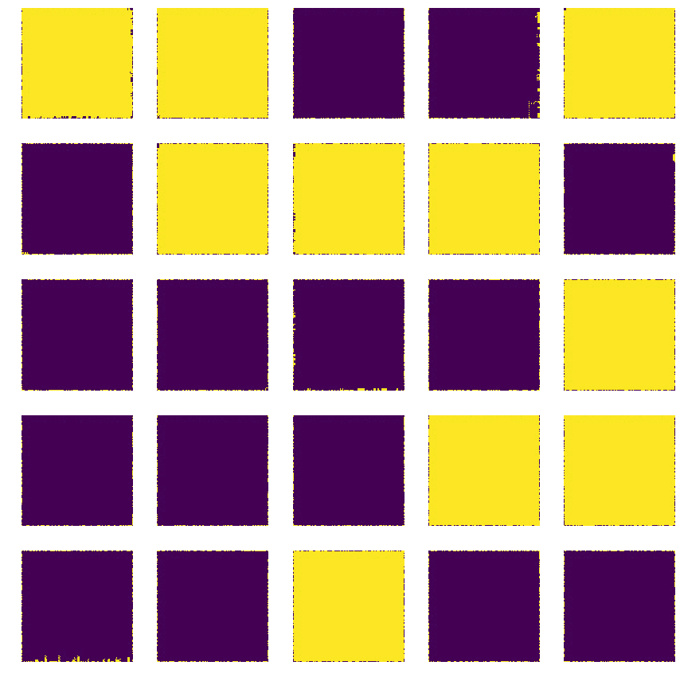
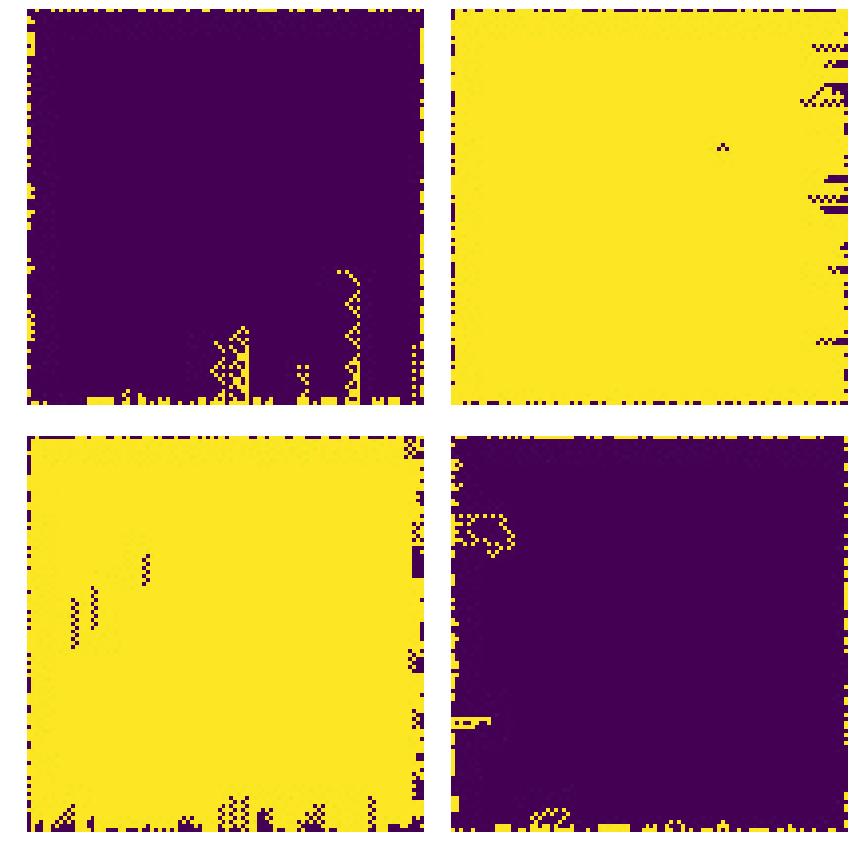
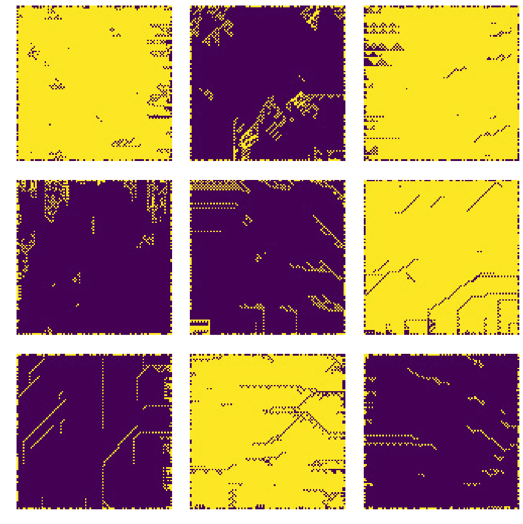
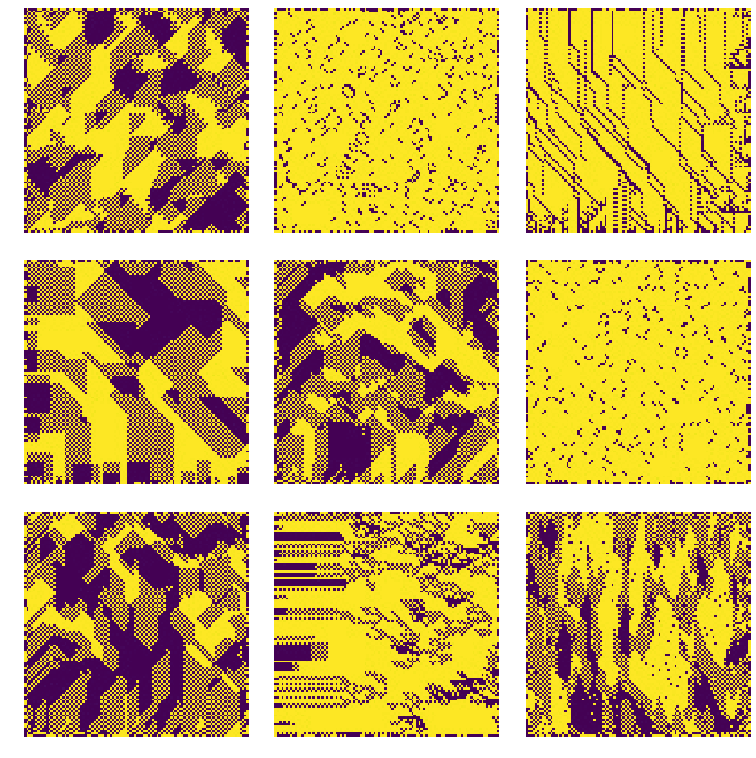
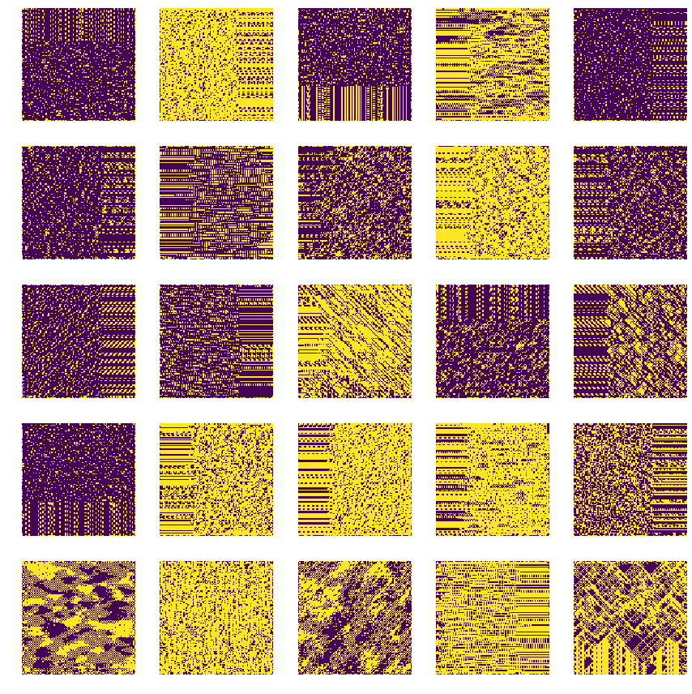
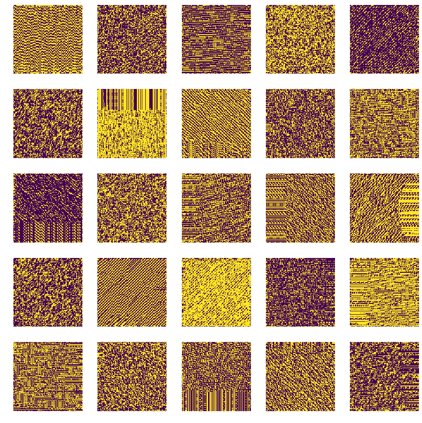

# Cellular Automata Classification
Some time ago I created a [small script](https://gist.github.com/mathigatti/439a0e81556f2698c7db4f41189d201f) to convert numbers into automata rules which generate different patterns. Using this I can try generating an infinite number of different patterns, the problem is that most of them are not really intereseting and I have not time to check them one by one. That's why here I try to automatize the process of finding out the intereseting cellular automatas.

## Clusterization
Cellular automata patterns are clusterized based on features related to beauty such as fractal dimensionality and compression efficiency. You can read more about why to use these features here: [Forsythe, Alex, et al. "Predicting beauty: fractal dimension and visual complexity in art." British journal of psychology 102.1 (2011): 49-70](https://www.researchgate.net/publication/49761486_Predicting_beauty_Fractal_dimension_and_visual_complexity_in_art).

### Cluster Examples

#### Cluster 0: Automata patterns without complexity

#### Cluster 1

#### Cluster 2

#### Cluster 3

#### Cluster 4

#### Cluster 5: Most complex automata patterns

